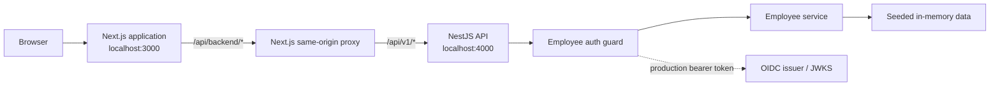

# Pulse AI

Pulse AI is an enterprise workforce-management application for recording, validating, submitting, and reviewing employee timesheets. The long-term product vision connects time capture to manager approvals, payroll preparation, invoicing, notifications, audit trails, and carefully scoped AI assistance.

This repository currently contains the first end-to-end **Employee timesheet vertical slice**: a responsive Next.js frontend communicates with a NestJS API to load, edit, save, and submit a weekly timesheet. The project is still an early implementation and uses seeded in-memory backend data rather than a database.

## Table of contents

- [Current status](#current-status)
- [Features](#features)
- [Technology stack](#technology-stack)
- [Architecture](#architecture)
- [Repository structure](#repository-structure)
- [Getting started](#getting-started)
- [Configuration](#configuration)
- [Available routes](#available-routes)
- [API reference](#api-reference)
- [Authentication](#authentication)
- [Validation and concurrency](#validation-and-concurrency)
- [Development commands](#development-commands)
- [Testing and quality](#testing-and-quality)
- [Design system and accessibility](#design-system-and-accessibility)
- [Known limitations](#known-limitations)
- [Planned direction](#planned-direction)
- [Project documentation](#project-documentation)

## Current status

Pulse AI is a functional prototype, not a production-ready workforce system.

| Area                                                   | Status                                         |
| ------------------------------------------------------ | ---------------------------------------------- |
| Employee application shell and responsive navigation   | Implemented                                    |
| Employee overview and timesheet history                | Implemented with frontend demo data            |
| Current weekly timesheet editor                        | Connected end to end                           |
| Save and submit operations                             | Implemented through the NestJS API             |
| Input validation and optimistic concurrency            | Implemented                                    |
| Development authentication and OIDC token verification | Implemented                                    |
| Persistent database storage                            | Not yet implemented; backend data is in memory |
| Manager, HR, Finance, and Director workspaces          | Planned                                        |
| Approval, payroll, invoice, and audit workflows        | Planned                                        |
| Anomaly detection and LLM assistant                    | Planned                                        |

## Features

The current Employee experience includes:

- A responsive application shell with employee navigation and profile context.
- An employee overview with current-period totals, warnings, daily hours, and recent timesheets.
- A weekly timesheet editor organized by project, task, and day.
- Save and submit flows backed by the NestJS service.
- Draft and rejected-timesheet editing rules.
- Read-only views for historical periods.
- Status badges for draft, submitted, approved, and rejected records.
- Local warnings for incomplete hours and API-generated issue information.
- Recovery behavior when the backend is unavailable: the current editor falls back to demo data and does not expose save or submit actions.
- Backend ownership checks that restrict Employee endpoints to the authenticated employee's records.
- Request validation for assignments, dates, hour limits, duplicate assignments, and payload shape.
- Optimistic version checks that prevent one session from silently overwriting another.
- Unit, component, accessibility, environment, and design-token tests.

## Technology stack

### Frontend

- [Next.js](https://nextjs.org/) 16 with the App Router
- [React](https://react.dev/) 19
- TypeScript
- CSS Modules and repository-owned design tokens
- Radix UI primitives for accessible dialogs and tooltips
- Lucide icons
- Zod for environment validation
- Vitest, Testing Library, and jest-axe for tests

### Backend

- [NestJS](https://nestjs.com/) 11
- TypeScript
- `class-validator` and `class-transformer` for DTO validation
- `jose` for OIDC/JWT verification through a remote JWKS
- Helmet for security headers
- Jest for unit tests
- Seeded in-memory data for the current prototype

### Planned platform components

The product documents describe PostgreSQL, Prisma migrations, background jobs, anomaly-detection services, audit logging, and a permission-aware LLM assistant. These components are part of the planned architecture and are **not present in the current codebase**.

## Architecture



The browser calls a same-origin Next.js route at `/api/backend/...`. That proxy forwards requests to the NestJS `/api/v1/...` API and passes through authorization, content-type, and `If-Match` headers. Keeping the backend URL server-only avoids exposing service configuration to browser code and provides one place to normalize unavailable-service responses.

The backend applies security headers, CORS, a global `/api/v1` prefix, and strict DTO validation. The Employee authentication guard resolves a development user locally or verifies a bearer token against the configured OIDC provider. Service methods then scope all records to the authenticated employee.

## Repository structure

```text
PulseAI_Emerson/
|-- backend/                 # NestJS API
|   |-- src/
|   |   |-- auth/            # Employee guard and request actor
|   |   |-- data/            # Seeded in-memory prototype data
|   |   |-- employee/        # Employee endpoints, service, and DTOs
|   |   |-- app.module.ts
|   |   `-- main.ts
|   |-- .env.example
|   |-- package.json
|-- frontend/                # Next.js web application
|   |-- src/
|   |   |-- app/             # App Router pages and backend proxy
|   |   |-- components/      # Shell and reusable UI primitives
|   |   |-- config/          # Typed environment boundary
|   |   |-- features/        # Employee feature and API client
|   |   |-- styles/          # Authoritative CSS design tokens
|   |   `-- test/            # Shared test setup
|   |-- .env.example
|   |-- package.json
|-- PRODUCT.md               # Product definition and principles
|-- design.md                # Authoritative UI design system
|-- Plan.md                  # Planning brief
|-- Employee Timesheet and Workforce Management System.docx
|-- FF_180_PulseAI_Completed_with_Architecture.pdf
`-- README.md
```

Generated folders such as `frontend/.next`, `backend/dist`, and each application's `node_modules` are not source code and should not be committed.

## Getting started

### Prerequisites

- Node.js 22.13 or newer in the Node 22 release line, or another version supported by the installed dependencies
- npm 10 or newer
- Two terminal windows for local development

No database or external identity provider is needed for the default local setup.

### 1. Install dependencies

Run the installs from the repository root:

```powershell
cd backend
npm ci

cd ../frontend
npm ci
```

Use `npm install` instead if you intentionally need to update a lockfile.

### 2. Create local environment files

The checked-in defaults already work for local development, so this step is optional. Copy the examples if you want explicit local configuration:

```powershell
Copy-Item backend/.env.example backend/.env
Copy-Item frontend/.env.example frontend/.env.local
```

Do not commit real identity-provider credentials or other secrets.

### 3. Start the backend

In the first terminal:

```powershell
cd backend
npm run start:dev
```

The API starts at `http://localhost:4000/api/v1` by default.

### 4. Start the frontend

In the second terminal:

```powershell
cd frontend
npm run dev
```

Open `http://localhost:3000`. The root page redirects to the Employee workspace.

### 5. Try the vertical slice

1. Open **Current timesheet** from the Employee overview.
2. Adjust hours for one or more assignments.
3. Save the timesheet; the backend validates it and increments its version.
4. Submit it for review.
5. Restart the backend to restore all seeded records to their original state.

## Configuration

### Backend environment

The backend reads `backend/.env` through NestJS Config.

| Variable           | Default/example                       | Purpose                                                        |
| ------------------ | ------------------------------------- | -------------------------------------------------------------- |
| `PORT`             | `4000`                                | NestJS listening port                                          |
| `FRONTEND_ORIGIN`  | `http://localhost:3000`               | Allowed browser origin for CORS                                |
| `ALLOW_DEV_AUTH`   | Enabled outside production when unset | Allows the seeded employee without a bearer token              |
| `DEV_AUTH_SUBJECT` | `dev-employee-avery`                  | OIDC subject used for the local seeded employee                |
| `OIDC_ISSUER`      | Provider URL                          | Expected token issuer                                          |
| `OIDC_AUDIENCE`    | `pulse-ai-api`                        | Expected token audience                                        |
| `OIDC_JWKS_URL`    | Provider JWKS URL                     | Public signing-key endpoint used to verify tokens              |
| `NODE_ENV`         | Runtime-defined                       | Controls development versus production authentication defaults |

If a bearer token is supplied, all three OIDC settings must be configured. In production, a bearer token is required unless development authentication is explicitly enabled; do not enable development authentication in a real deployment.

### Frontend environment

The frontend reads `frontend/.env.local` and validates server-side values with Zod.

| Variable          | Default                 | Purpose                                     |
| ----------------- | ----------------------- | ------------------------------------------- |
| `BACKEND_API_URL` | `http://localhost:4000` | NestJS origin used by the server-side proxy |

`BACKEND_API_URL` is intentionally server-only. Browser-exposed variables must use the `NEXT_PUBLIC_` prefix and must never contain secrets.

## Available routes

| Route                             | Data source                   | Description                                           |
| --------------------------------- | ----------------------------- | ----------------------------------------------------- |
| `/`                               | —                             | Redirects to `/employee`                              |
| `/employee`                       | Frontend demo data            | Employee overview, alerts, totals, and recent periods |
| `/employee/timesheets/current`    | NestJS API with demo fallback | Editable current weekly timesheet                     |
| `/employee/timesheets/history`    | Frontend demo data            | Timesheet-history table and summary                   |
| `/employee/timesheets/[periodId]` | Frontend demo data            | Read-only historical timesheet detail                 |
| `/api/backend/[...path]`          | Next.js proxy                 | Same-origin bridge to the NestJS API                  |

## API reference

All backend endpoints use the `/api/v1/employee` prefix and are protected by the Employee authentication guard.

| Method  | Endpoint                                          | Description                                              |
| ------- | ------------------------------------------------- | -------------------------------------------------------- |
| `GET`   | `/api/v1/employee/me`                             | Return the authenticated employee profile                |
| `GET`   | `/api/v1/employee/timesheets/current`             | Return the current editable or pending timesheet         |
| `GET`   | `/api/v1/employee/timesheets`                     | List the employee's timesheets                           |
| `GET`   | `/api/v1/employee/timesheets/:timesheetId`        | Return one employee-owned timesheet                      |
| `PATCH` | `/api/v1/employee/timesheets/:timesheetId`        | Replace assignment/day entries for an editable timesheet |
| `POST`  | `/api/v1/employee/timesheets/:timesheetId/submit` | Submit a draft or resubmit a rejected timesheet          |
| `GET`   | `/api/v1/employee/notifications`                  | List notifications belonging to the employee user        |

With the backend running under default development authentication, a profile request can be tested directly:

```powershell
Invoke-RestMethod http://localhost:4000/api/v1/employee/me
```

Update and submit requests must include the record's current `expectedVersion`. The frontend handles this automatically.

## Authentication

The backend has two authentication paths:

1. **Local development:** when no bearer token is present and development authentication is allowed, the guard uses `DEV_AUTH_SUBJECT` to resolve the seeded Avery Rao Employee account.
2. **OIDC bearer token:** when an `Authorization: Bearer ...` header is present, the guard verifies its signature and claims using the configured issuer, audience, and remote JWKS URL. The token's `sub` claim must map to an active Employee user.

Authentication and authorization are backend responsibilities. The current frontend does not yet include sign-in pages or an OIDC client flow, although its proxy forwards an incoming authorization header.

## Validation and concurrency

The API uses a global validation pipe that transforms DTOs, strips unknown properties, and rejects non-whitelisted fields. Timesheet updates also enforce domain checks:

- Each assignment may appear only once.
- Assignments must belong to the authenticated employee.
- Dates must fall inside the timesheet period.
- A single entry is limited to 24 hours per day.
- Combined entries cannot exceed 24 hours for the same date.
- Only `DRAFT` and `REJECTED` timesheets can be edited or submitted.
- `expectedVersion` must match the server record before a save or submission succeeds.

Every successful mutation increments the version. A stale client receives HTTP `409 Conflict` and must refresh before retrying. This is optimistic concurrency control: it prevents lost updates without holding long-lived database locks.

## Development commands

Commands are run inside the relevant application directory.

### Frontend

| Command                | Purpose                                   |
| ---------------------- | ----------------------------------------- |
| `npm run dev`          | Start the Next.js development server      |
| `npm run build`        | Create a production build                 |
| `npm run start`        | Serve a previously built application      |
| `npm run typecheck`    | Type-check without emitting files         |
| `npm run lint`         | Run ESLint with zero warnings allowed     |
| `npm run test`         | Run Vitest once                           |
| `npm run test:watch`   | Run Vitest in watch mode                  |
| `npm run format`       | Format supported files with Prettier      |
| `npm run format:check` | Check formatting without changing files   |
| `npm run check`        | Run formatting, types, linting, and tests |

### Backend

| Command             | Purpose                                  |
| ------------------- | ---------------------------------------- |
| `npm run start:dev` | Start NestJS in watch mode               |
| `npm run start`     | Start NestJS once                        |
| `npm run build`     | Compile the NestJS application           |
| `npm run typecheck` | Type-check without emitting files        |
| `npm run lint`      | Run ESLint with zero warnings allowed    |
| `npm run test`      | Run Jest serially                        |
| `npm run check`     | Run types, linting, tests, and the build |

## Testing and quality

Before opening a pull request, run both application check suites:

```powershell
cd backend
npm run check

cd ../frontend
npm run check
npm run build
```

The frontend `check` script does not include the production build, so `npm run build` is listed separately. Existing coverage exercises the app shell, employee views, current-timesheet behavior, API payloads, environment parsing, accessibility smoke checks, design-token ownership and contrast, backend authentication, employee scoping, and in-memory updates.

Tests are colocated with the source they verify using `*.test.ts`, `*.test.tsx`, and `*.spec.ts` filenames.

## Design system and accessibility

Pulse AI uses a calm enterprise visual language designed for dense operational work:

- White and cool-gray work surfaces with restrained cobalt actions.
- Explicit text and icon status indicators rather than color alone.
- Tabular numerals for hours, dates, totals, and identifiers.
- A visible “pulse rail” for local state and exception emphasis.
- Responsive behavior for essential Employee tasks.
- Keyboard access, visible focus, semantic structure, reduced-motion support, and WCAG 2.2 AA contrast targets.

The repository-level `design.md` is the design authority. `frontend/src/styles/tokens.css` is its implementation boundary; component styles should consume those CSS custom properties instead of introducing independent color or spacing systems.

## Known limitations

- Backend changes are held in process memory and disappear on restart.
- Only one seeded Employee identity and a small set of assignments, notifications, and timesheets are available.
- The overview and history pages do not yet consume backend endpoints.
- There is no frontend sign-in or token-acquisition flow.
- Manager approval and rejection endpoints are not implemented.
- HR, Finance, and Director roles are not implemented.
- There is no PostgreSQL schema, migration system, background worker, email delivery, payroll export, invoice generation, or audit-event store.
- Anomaly warnings in demo screens are illustrative; no statistical model is running.
- No LLM or generative-AI service is connected.
- The prototype should not be used for real employee, payroll, compensation, or customer data.

## Planned direction

The documented product direction is to expand from the Employee slice into a complete weekly workflow:

1. Add PostgreSQL persistence, migrations, seed tooling, and transactional repositories.
2. Complete authentication and backend-enforced role, organization, resource, action, and field-level authorization.
3. Connect all Employee pages to the API.
4. Add manager review queues, rejection reasons, resubmission, approval, locking, and reopen controls.
5. Add HR workforce administration and compliance monitoring.
6. Add Finance-controlled payroll-ready exports and invoice preparation.
7. Add durable notifications, scheduled reminders, background jobs, and audit events.
8. Add deterministic policy checks before statistical anomaly detection.
9. Add a read-only, permission-aware assistant only where it provides explainable value.

AI is intended to supplement deterministic controls. It must not approve timesheets, calculate payroll, bypass authorization, or execute arbitrary database queries.

## Project documentation

- [`PRODUCT.md`](PRODUCT.md) defines the product purpose, users, scope, principles, and constraints.
- [`design.md`](design.md) defines the authoritative visual and interaction system.
- [`Plan.md`](Plan.md) contains the planning directive and requested roadmap structure.
- [`Employee Timesheet and Workforce Management System.docx`](Employee%20Timesheet%20and%20Workforce%20Management%20System.docx) is the source requirements document.
- [`FF_180_PulseAI_Completed_with_Architecture.pdf`](FF_180_PulseAI_Completed_with_Architecture.pdf) contains the project synopsis and preliminary architecture.

## Contributing

Keep changes aligned with `PRODUCT.md` and `design.md`, preserve backend authorization boundaries, and avoid presenting planned capabilities as implemented. Add or update tests with behavior changes and run the relevant check suite before submitting work.

This repository does not currently declare a license. Treat the source as private unless the project owner adds one.
